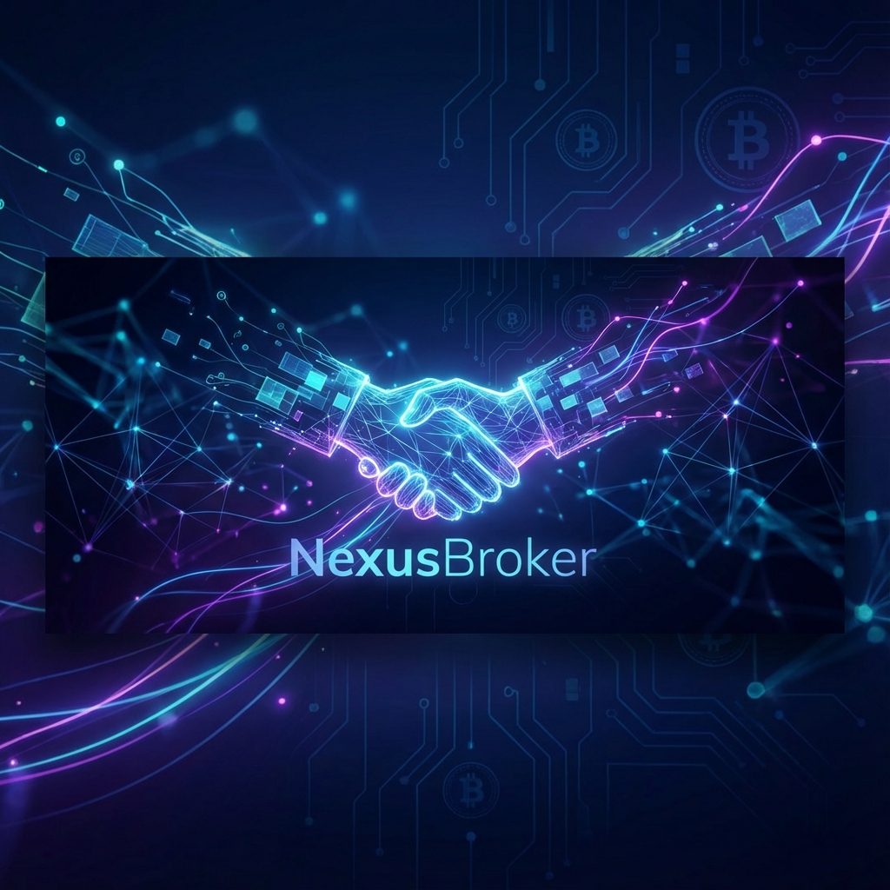

<p align="center">
  
</p>

<p align="center">
  
  
  
  
</p>

---

<div align="center">

# 🔗 NexusBroker: The Intelligent Intermediary Protocol
### "Markets, Automating Trust. The Broker of Truth."

</div>

**NexusBroker**, sadece bir yazılım değil, geleneksel ticaretin hantal yapı taşlarını yıkarak yerine **Yapay Zeka (AI)** ve **Dağıtık Defter Teknolojisi (DLT)** tabanlı yeni bir dijital omurga inşa eden devrimci bir hibrit ekosistemdir. Günümüzün karmaşık, opak ve verimsiz ticaret ağlarında; alıcı, satıcı ve aracı arasındaki "güven boşluğunu" matematiksel kesinlik ve algoritmik şeffaflıkla doldurur. NexusBroker, insan faktöründen kaynaklanan manipülasyonları, gecikmeleri ve güven erozyonunu ortadan kaldırarak, ticaretin en saf, en hızlı ve en adil halini sunar.

---

## 🏛️ Nexus Manifestosu (The Core Philosophy)

> "Güven, hissedilen bir duygu değil, doğrulanan bir veri noktası olmalıdır."

Nexus Intelligence (NI), piyasaların kaotik birer alışveriş meydanı değil, canlı, nefes alan ve sürekli veri üreten devasa dijital organizmalar olduğuna inanır. Bu vizyon doğrultusunda, NexusBroker mimarisi üç sarsılmaz sütun üzerine inşa edilmiştir:

1.  **Mutlak Şeffaflık (Radical Transparency):** Ekosistemdeki her teklif, her revizyon, her onay ve her işlem; değiştirilemez, silinemez ve manipüle edilemez bir blokzincir defterinde (immutable ledger) zaman damgasıyla mühürlenir. Bu sayede "söz uçar ama blockchain kalır" ilkesiyle, ticari geçmişin matematiksel bir kanıtı oluşturulur.
2.  **Otonom Güven (Autonomous Trust):** Geleneksel sözleşmelerin yoruma açık ve ihlale müsait yapısının aksine, NexusBroker'ın Akıllı Sözleşmeleri (Smart Contracts), kodun kanun olduğu (Code is Law) bir prensiple çalışır. Şartlar sağlandığında işlem otomatik olarak gerçekleşir; insan hatası, unutkanlık veya kötü niyet denklemin dışına itilir.
3.  **Bilişsel Hız (Cognitive Speed & Latency):** İnsan zihninin ve manuel süreçlerin işleyemeyeceği hızda çalışan yapay zeka motorumuz, milisaniyeler içinde milyonlarca veri setini, pazar trendini ve kullanıcı davranışını tarar. Amacımız sadece "yakın" bir eşleşme bulmak değil, parametrik olarak en "doğru", en karlı ve en sürdürülebilir eşleşmeyi yıldırım hızında gerçekleştirmektir.

---

## 🚀 Temel Vizyon (Visionary Framework)

Brokerlık ve aracılık dünyası, 21. yüzyılda bile hala sonsuz telefon trafiği, güncellenmeyen Excel tabloları, manuel e-posta zincirleri ve yorucu fiziksel onay süreçleriyle yönetilmektedir. Bu verimsizlik, küresel ticarette milyarlarca dolarlık kayba ve zaman israfına yol açar. **NexusBroker**, bu arkaik süreci temelden sarsarak şu üç ana eksen üzerine yeniden kurgular:

*   **⚡ Hiper-Hızlı Eşleşme (Hyper-Velocity Matching):** Gelişmiş "Matching Engine" mimarimiz, alıcı ve satıcı profillerini çok boyutlu vektör uzayında analiz eder. Sadece fiyatı değil; konum, itibar, geçmiş ticaret hacmi, lojistik uygunluk gibi yüzlerce parametreyi aynı anda değerlendirerek, saniyeler içinde optimum ticari partnere ulaşmanızı sağlar.
*   **🛡️ Kriptografik Güven (Cryptographic Assurance):** Ödeme ve komisyon süreçleri, üçüncü şahısların insafına bırakılmaz. Akıllı sözleşmelerimiz, fonları güvenli bir "Escrow" (Emanet) havuzunda tutar ve hizmet tamamlandığında otomatik olarak serbest bırakır. Bu, "ödeme alabilir miyim?" veya "hizmeti alabilir miyim?" korkusunu tamamen ortadan kaldırır.
*   **🧠 Öngörüsel Zeka (Predictive Intelligence):** Sadece bugünün verisiyle değil, geleceğin projeksiyonuyla hareket eder. NexusBroker'ın AI asistanı, geçmiş piyasa verilerini, küresel trendleri ve haber akışlarını analiz ederek, kullanıcılarına gelecekteki fiyat hareketleri ve pazar fırsatları hakkında stratejik öngörüler sunar.

---

## ⚡ The Great Disintermediation: Brokerlık Dönemi Kapanıyor

NexusBroker, geleneksel "sahibinden" modellerini AI otonomisiyle birleştirerek, verimsiz aracıları (middlemen) tamamen denklemden çıkarmayı ve "Peer-to-Peer" (Eşten Eşe) ticaretin altın çağını başlatmayı hedefler. **Nexus Marketplace**, `marketplace/` dizini altında bu vizyonun ilk somut, yaşayan laboratuvarını ve fiziksel iskeletini barındırmaktadır.

### Neden Nexus Marketplace Devrimseldir?
*   **Aracısız, Sürtünmesiz Ticaret:** Alıcı ve satıcı, yapay zeka destekli eşleşme algoritmaları sayesinde, aradaki tüm parazitleri ve komisyoncuları atlayarak doğrudan, şeffaf ve en doğru piyasa fiyatından bir araya gelir.
*   **Trustless Escrow (Güven Gerektirmeyen Emanet):** Bir noter veya güvenilir üçüncü tarafa ihtiyaç duymadan, kod tabanlı emanet sistemi ödemeyi garanti altına alır. Ürün veya hizmet doğrulanana kadar para güvendedir, doğrulandığı an transfer gerçekleşir.
*   **Vektörel Anlamsal Arama (Semantic Vector Search):** Kullanıcılar, karmaşık filtrelerle uğraşmak yerine "Bana İstanbul'da, deniz manzaralı, krediye uygun ve fiyatı düşünce haber verecek bir 3+1 daire bul" gibi doğal dilde isteklerini belirtir. "Nexus Intelligence", bu isteği anlar ve veritabanındaki binlerce ilan arasından en alakalı sonuçları anında sunar.

---

## 🏗️ Teknik Mimari (System Sovereignty & Architecture)

NexusBroker mimarisi, yüksek frekanslı veri işleme kapasitesine sahip modern bir backend ile, güvenliğin ve değişmezliğin kalesi olan blokzincir tabanlı settlement katmanlarını kusursuz bir uyumla birleştirir.

```mermaid
graph TD
    A[Market Requests / Signals] -->|Ingestion| B{Nexus Core Intelligence}
    B -->|Neural Analysis| C[AI Matching Engine]
    B -->|Smart Contract Call| D[Blockchain Trust Layer]
    C -->|Vector Embeddings| E[Pinecone/Milvus DB]
    D -->|Transaction Settlement| F[Smart Contracts (L2 / Sidechain)]
    E -->|Similarity Search| G[Verified Pairings]
    F -->|Consensus| G
    G -->|Execution| H[Final Deal & Commission Autonomy]
    
    subgraph "Intelligence Layer (Off-Chain)"
    C
    E
    end
    
    subgraph "Trust Layer (On-Chain)"
    D
    F
    end
```

### 1. AI Matching Engine (Python/FastAPI)
Bu motor, sistemin beynidir. Geleneksel veritabanı sorgularının ötesine geçerek:
*   **Vector Search & Embeddings:** Milyonlarca alım-satım talebini yüksek boyutlu vektörlere dönüştürür ve milisaniyeler içinde birbirine en yakın "anlamsal" eşleşmeleri bulur.
*   **Sentiment & Risk Analysis:** Doğal Dil İşleme (NLP) teknolojilerini kullanarak, taraflar arasındaki yazışmaların tonunu, piyasa duyarlılığını analiz eder ve işlemin başarıyla kapanma olasılığını (Probability of Closing) yüzdesel olarak hesaplar.

### 2. Trust Layer (Solidity/Ethereum-L2)
Bu katman, sistemin kalbidir ve finansal güvenliği sağlar:
*   **DeFi Escrow Contracts:** Alıcı ve satıcı anlaştığı anda, işlem tutarı merkeziyetsiz bir akıllı sözleşmeye kilitlenir. Hiçbir merkezi otorite bu fona keyfi olarak müdahale edemez.
*   **Autonomous Commission:** İşlem başarıyla tamamlandığında, sistem protokolü tarafından belirlenen komisyon oranı, herhangi bir insan onayına gerek kalmadan saniyeler içinde ilgili cüzdanlara (platform ve varsa aracı) dağıtılır.

---

## 🛠️ Modüller (Sektörel Paketler)

NexusBroker çekirdeği (Core), monolitik bir yapı değil, modüler bir "tak-çalıştır" mimarisi olarak tasarlanmıştır. Bu sayede farklı endüstrilerin spesifik ihtiyaçlarına anında adapte olabilir:

| Modül | Sektör | Temel Özellik ve Katma Değer |
| :--- | :--- | :--- |
| 🚢 **NexusMaritime** | Denizcilik & Lojistik | Küresel navlun piyasasında gemi boşluklarını (space) ve yükleri (cargo) optimize eder, boş dönüşleri minimize eder. |
| 📉 **NexusFinance** | Finans & OTC | Tezgah üstü (OTC) piyasalarda büyük hacimli varlık takasları için likidite sağlayıcıları ve kurumsal alıcıları gizlilik içinde eşleştirir. |
| 🏠 **NexusEstate** | Gayrimenkul & PropTech | Mülklerin dijital ikizlerini oluşturur, tapu süreçlerini blokzincire taşır ve güvenli sanal veri odaları (VDR) ile Due Diligence süreçlerini yönetir. |
| 🛡️ **NexusInsur** | Sigorta & Risk | Poliçe taleplerini ve risk profillerini otomatik olarak analiz eder, en uygun sigorta tekliflerini saniyeler içinde sunar ve hasar süreçlerini yönetir. |

---

## 📂 Repository Yapısı

Proje, modern yazılım geliştirme standartlarına uygun, modüler ve ölçeklenebilir bir dizin yapısına sahiptir:

```bash
├── core/                # Sistemin beyni. Eşleştirme motoru, ana iş mantığı ve API gateway.
├── blockchain/          # Güven katmanı. Solidity ile yazılmış akıllı sözleşmeler, testler ve dağıtım scriptleri.
├── dashboard/           # Kullanıcı arayüzü. Brokerlar ve son kullanıcılar için Next.js ile geliştirilmiş reaktif dashboard.
├── marketplace/         # P2P Market modülü. İlan listeleme, arama ve filtreleme fonksiyonları.
├── ai-models/           # Yapay Zeka laboratuvarı. Fiyat tahminleme, NLP ve öneri sistemi modelleri.
├── integrations/        # Dış dünya köprüsü. Banka API'leri, lojistik servisleri ve blokzincir node bağlantıları.
└── docs/                # Bilgi bankası. Kapsamlı API dökümantasyonu, Whitepaper ve sistem mimarisi şemaları.
```

---

## 🛠️ Operasyonel Direktifler (CLI Guide)

Bu ileri teknoloji ekosistemi yerel ortamınızda ayağa kaldırmak ve test etmek için aşağıdaki kesin protokolleri izleyin:

### 1. Çekirdek Kurulumu (Core Initialization)
Sistemin kaynak kodlarını yerel makinenize çekin ve gerekli bağımlılıkları yükleyin:
```powershell
# Repository'yi klonlayın
git clone https://github.com/username/nexus-broker.git

# Proje dizinine girin ve hem Backend (Python) hem de Frontend (Node.js) bağımlılıklarını enjekte edin
cd nexus-broker && npm install && pip install -r requirements.txt
```

### 2. Güvenlik Konfigürasyonu (Security Config)
Sistem güvenliği için çevre değişkenlerini ayarlayın. `.env.example` şablonunu kopyalayarak kendi `.env` dosyanızı oluşturun ve `NEXUS_API_KEY`, `BLOCKCHAIN_PROVIDER_URL` gibi kritik anahtarları tanımlayın.

### 3. Deployment & Orkestrasyon
Tüm mikroservisleri, veritabanlarını ve ön yüzü tek bir komutla, izole edilmiş konteynerler içinde ayağa kaldırın:
```bash
docker-compose up --build -d
```

---

## 📈 Yol Haritası (Strategic Roadmap)

NexusBroker, statik bir proje değil, yaşayan ve evrilen bir organizmadır. Gelecek vizyonumuz net ve iddialıdır:

### 2024 Phase: Foundational Stability (Temel ve İstikrar)
- [x] **Q1: Core Matching Engine (Beta):** İlk vektörel eşleşme motorunun canlıya alınması ve test edilmesi.
- [ ] **Q2: Multi-currency Smart Contract Entegrasyonu:** Farklı fiat paralar ve kripto varlıklarla işlem yapabilme yeteneği.
- [ ] **Q3: Mobil "Broker Assistant" (iOS & Android):** Brokerların cebinde taşıyabileceği, sesli komutla çalışan AI asistan uygulaması.
- [ ] **Q4: Big Data Predictive Analytics:** Büyük veri setleri üzerinden piyasa yönünü tahmin eden ileri analitik modülü.

### 2025 Phase: Global Sovereignty (Küresel Hakimiyet)
- [ ] **Q1: Quantum-Resistant Escrow Protocols:** Geleceğin kuantum bilgisayarlarına karşı dayanıklı, kırılamaz şifreleme algoritmaları.
- [ ] **Q2: Full DAO Governance Integration:** Platformun yönetiminin topluluğa devredilmesi ve merkeziyetsiz otonom organizasyon yapısına geçiş.
- [ ] **Q3: Nexus AI v2: Autonomous Negotiation Agent:** Sizin adınıza pazarlık yapabilen, teklif verip alabilen tam otonom yapay zeka ajanları.

---

## 👨‍💻 Geliştirici (The Architect)

**Bahattin Yunus Çetin**  
*IT Architect & Visionary*

Trabzon Of'ta akademi ve teknoloji dünyası arasındaki köprüyü kuran, üniversite eğitimine devam ederken küresel ölçekte projeler geliştiren Bahattin Yunus; teknolojiyi sadece bir kod yığını olarak değil, toplumları dönüştüren bir "felsefe" olarak görür. NexusBroker, bu vizyonun, veriyle örülmüş ve güvenle mühürlenmiş somut bir manifestosudur.

*   🌐 **GitHub:** [github.com/bahattinyunus](https://github.com/bahattinyunus)
*   💼 **LinkedIn:** [linkedin.com/in/bahattinyunus](https://www.linkedin.com/in/bahattinyunus/)

---

## 🤝 Katkıda Bulunma

NexusBroker, kolektif zekaya inanan açık kaynaklı bir inisiyatiftir. Bu devrimin bir parçası olmak, kod katkısında bulunmak veya vizyonu genişletmek için lütfen `CONTRIBUTING.md` dosyasını inceleyin. Geleceğin ticaretini, satır satır kodla ve sarsılmaz bir inançla, hep birlikte inşa edelim.

---

<p align="center">
  <b>NexusBroker</b> | <i>Connecting Markets, Automating Trust.</i><br>
  Built with 💻 and 🦾 for the future of trade.
</p>
