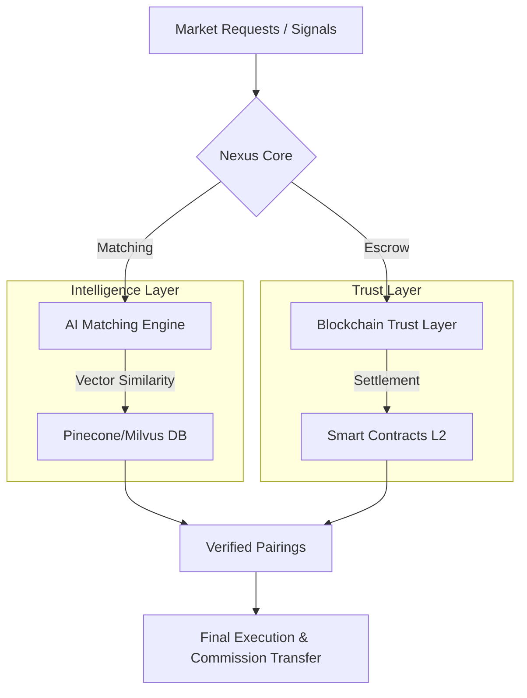

<p align="center">
  
</p>

<p align="center">
  
  
  
</p>

---

<div align="center">

# 🔗 NexusBroker: The Intelligent Intermediary Protocol
### "Markets, Automating Trust. The Broker of Truth."

</div>

**NexusBroker**, geleneksel aracılık (brokerlık) mekanizmalarını **AI (Yapay Zeka)** ve **Distributed Ledger (Dağıtık Defter)** teknolojileriyle yeniden tanımlayan hibrit bir ekosistemdir. Bu protokol; karmaşık ticaret ağlarındaki alıcı, satıcı ve aracı arasındaki güven boşluğunu teknolojiyle doldurur.

---

## 🏛️ Nexus Manifestosu (The Core Philosophy)

> "Güven, bir veri noktası olmalıdır."

Nexus Intelligence (NI), piyasaların sadece birer alışveriş alanı değil, yaşayan birer veri ağı olduğuna inanır. NexusBroker'ın üç temel sütunu:

1.  **Mutlak Şeffaflık:** Her işlem, her onay ve her eşleşme matematiksel bir kesinlikle kayıt altına alınır.
2.  **Otonom Güven:** Akıllı sözleşmeler (Smart Contracts), insan hatasını ve kötü niyetini denklemden çıkarır.
3.  **Bilişsel Hız:** Milisaniyeler içinde milyonlarca veri setini tarayarak en 'doğru' eşleşmeyi bulur, sadece 'yakın' olanı değil.

---

## 🚀 Temel Vizyon

Brokerlık dünyası hala telefon trafiği, Excel tabloları ve manuel onay süreçleriyle yönetiliyor. **NexusBroker** bu süreci şu üç temel üzerine oturtur:

*   **⚡ Hız:** Milisaniyeler içinde en uygun eşleşme (Matching Engine).
*   **🛡️ Güven:** Akıllı sözleşmeler ile garanti altına alınmış komisyon ve ödeme süreçleri.
*   **🧠 Zeka:** Geçmiş verileri analiz ederek gelecekteki piyasa trendlerini öngören AI asistanı.

---

## ⚡ The Great Disintermediation: Brokerlık Dönemi Kapanıyor

NexusBroker, geleneksel "sahibinden" modellerini AI otonomisiyle bir üst seviyeye taşıyarak aracıları tamamen denklemden çıkarmayı hedefler. **Nexus Marketplace**, `marketplace/` dizini altında bu vizyonun ilk fiziksel iskeletini barındırmaktadır.

### Neden Nexus Marketplace?
*   **Aracısız Ticaret:** Alıcı ve satıcı, AI Matching sayesinde en doğru fiyatta ve en doğru kişiyle doğrudan buluşur.
*   **Trustless Escrow:** Komisyoncuya gerek kalmadan, akıllı sözleşmeler ödemeyi garanti altına alır.
*   **Vektörel Market:** İhtiyacınızı yazdığınızda, binlerce ilanı tek tek gezmek yerine "Nexus Intelligence" sizi doğrudan nihai satıcıyla bağlar.


---

## 🏗️ Teknik Mimari (System Sovereignty)

Nexus mimarisi, yüksek frekanslı veri işleme ile güvenli settlement katmanlarını birleştirir.



### 1. AI Matching Engine (Python/FastAPI)
*   **Vector Search:** Talepleri ve arzları vektör veri tabanında tutarak en yakın eşleşmeyi bulur.
*   **Sentiment Analysis:** Broker görüşmelerindeki tonlamadan işlemin kapanma olasılığını (Probability of Closing) hesaplar.

### 2. Trust Layer (Solidity/Ethereum-L2)
*   **Escrow Contracts:** Alıcı ve satıcı anlaştığında, ödeme güvenli bir havuzda toplanır.
*   **Auto-Commission:** İşlem onaylandığında broker komisyonu saniyeler içinde cüzdana aktarılır.

---

## 🛠️ Modüller (Sektörel Paketler)

NexusBroker çekirdeği (Core), farklı sektörlere tak-çıkar mantığıyla entegre olur:

| Modül | Sektör | Temel Özellik |
| :--- | :--- | :--- |
| 🚢 **NexusMaritime** | Denizcilik | Gemi boşlukları ve yük eşleştirme. |
| 📉 **NexusFinance** | Finans | OTC likidite sağlayıcı broker motoru. |
| 🏠 **NexusEstate** | Gayrimenkul | Dijital veri odası (VDR) & Portföy yönetimi. |
| 🛡️ **NexusInsur** | Sigorta | Otomatik underwriting & Poliçe eşleşme. |

---

## 📂 Repository Yapısı

```bash
├── core/                # Eşleştirme motoru ve ana mantık
├── blockchain/          # Smart Contract (Solidity) dosyaları
├── dashboard/           # Brokerlar için Next.js arayüzü
├── marketplace/         # Sahibinden Disruptor (P2P Market)
├── ai-models/           # Tahminleme ve NLP modelleri
├── integrations/        # 3. parti API (Banka, Gümrük, Lojistik) bağlantıları
└── docs/                # API dökümantasyonu ve Whitepaper
```

---

## 🛠️ Operasyonel Direktifler (CLI Guide)

Sistemi ayağa kaldırmak için aşağıdaki protokolleri izleyin:

### 1. Çekirdek Kurulumu
```powershell
# Repo'yu klonlayın
git clone https://github.com/username/nexus-broker.git

# Bağımlılıkları enjekte edin
cd nexus-broker && npm install && pip install -r requirements.txt
```

### 2. Güvenlik Konfigürasyonu
`.env.example` dosyasını `.env` olarak kopyalayın ve `NEXUS_API_KEY` değerini tanımlayın. 

### 3. Deployment
```bash
docker-compose up --build -d
```

---

## 📈 Yol Haritası (Strategic Roadmap)

### 2024 Phase: Foundational Stability
- [x] **Q1:** Core Matching Engine (Beta)
- [ ] **Q2:** Multi-currency Smart Contract Entegrasyonu
- [ ] **Q3:** Mobil "Broker Assistant" (iOS & Android)
- [ ] **Q4:** Big Data Predictive Analytics

### 2025 Phase: Global Sovereignty
- [ ] **Q1:** Quantum-Resistant Escrow Protocols
- [ ] **Q2:** Full DAO Governance Integration
- [ ] **Q3:** Nexus AI v2: Autonomous Negotiation Agent

---

## 🤝 Katkıda Bulunma

NexusBroker açık kaynaklı bir projedir. Katkıda bulunmak için lütfen `CONTRIBUTING.md` dosyasını inceleyin. Bu protokolün bir parçası olun ve geleceğin ticaretini bizimle inşa edin.

---

<p align="center">
  <b>NexusBroker</b> | <i>Connecting Markets, Automating Trust.</i><br>
  Built with 💻 and 🦾 for the future of trade.
</p>
